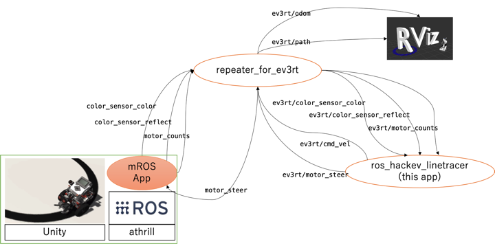

# mROS_app_on_athrill




This repository shows how to use the system test function of R2S2 (RDBOX Robotics Simulation System).  
For more information on ROS topics and nodes, please refer to [rdbox\-intec/ros\_hackev\_linetracer: GitHub](https://github.com/rdbox-intec/ros_hackev_linetracer).

## Architecture

The EV3Robot CPU we chose for our experiment is ARMv7. ([Lego Mindstorms EV3 \- Wikipedia](https://en.wikipedia.org/wiki/Lego_Mindstorms_EV3))  
Athrill emulates the ARMv7 environment. We are able to run tests in an environment closer to the actual machine than ever before.

- [mROS App](https://github.com/rdbox-intec/ev3rt-athrill-ARMv7-A) is a ROS node that runs on mROS.
  - [The original source code](https://github.com/toppers/ev3rt-athrill-ARMv7-A) includes a line trace program. but this repository, which we forked, is devoted only to the passing of topic messages.
  - In addition, we changed the network settings for roscore to make it easier for Kubernetest to handle.
    - Fix the IP address of roscore to localhost.
    - The IP address of roscore can be specified from the outside using the packet repeater, [stone \- a simple TCP/IP packet repeater](http://manpages.ubuntu.com/manpages/bionic/en/man1/stone.1.html).
  - [See the source code for details.](https://github.com/rdbox-intec/ev3rt-athrill-ARMv7-A/blob/master/sdk/mros-obj/app.cpp)
- [mROS](https://github.com/tlk-emb/mROS) is a A light-weighted runtime environment for ROS nodes onto embedded micro-controller.
- [athrill](https://github.com/toppers/athrill) is a CPU emulator.

## Usage

When you do a git clone, you need to specify that you want to get the submodules.

```bash
git clone --recursive https://github.com/rdbox-intec/mROS_app_on_athrill.git
```

The application provided in this repository uses mmap to communicate with Unity. [for more information.](https://toppers.github.io/hakoniwa/single-robot-setup-detail/60_unity_install_v2.0/)

```bash
athrill2 -c1 -t -1 -m /tmp/ev3rt/memory_mmap.txt -d /tmp/ev3rt/device_config_mmap.txt /tmp/ev3rt/asp
```

The Docker image hosted on [docker hub](https://hub.docker.com/repository/docker/rdbox/mros_app_on_athrill)

```bash
docker pull rdbox/mros_app_on_athrill:v0.0.1
```

## Licence

[MIT](https://github.com/rdbox-intec/mROS_app_on_athrill/blob/main/LICENSE)
